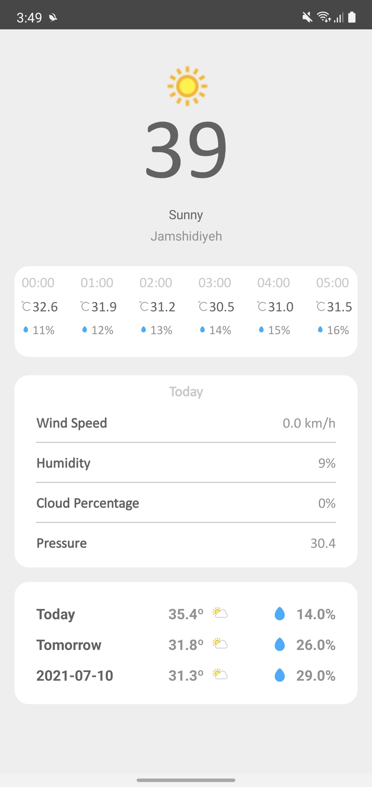

# Weather App

This application gets user location and shows current weather information.

## Tech

These tools have been used in this project:

1. [Kotlin](https://kotlinlang.org)
2. [Kotlin Coroutines](https://kotlinlang.org/docs/coroutines-overview.html)
3. [Retrofit](https://square.github.io/retrofit/)
3. [Moshi](https://github.com/square/moshi)
7. [Espresso](https://developer.android.com/training/testing/espresso)
7. [View Model](https://developer.android.com/topic/libraries/architecture/viewmodel)
8. [Live Data](https://developer.android.com/topic/libraries/architecture/livedata)
9. [Navigation](https://developer.android.com/guide/navigation)
10. [View Binding](https://developer.android.com/topic/libraries/view-binding)
11. [Hilt](https://developer.android.com/training/dependency-injection/hilt-android)
12. [JUnit](https://junit.org/junit4/)
13. [Glide](https://bumptech.github.io/glide/)
14. [Ktlint](https://github.com/pinterest/ktlint)

Only tested on

1. Samsung Galaxy Note 10+
2. Pixel 3a
3. Pocophone f1

## Design

The design is minimalistic. I made it with the sketch app.
You can get the sketch file here.

## Backend

[Weather Api](https://www.weatherapi.com) was used to for the remote data.
You will need an access key to get the app working.

## Download

You can download the apk directly from here.
